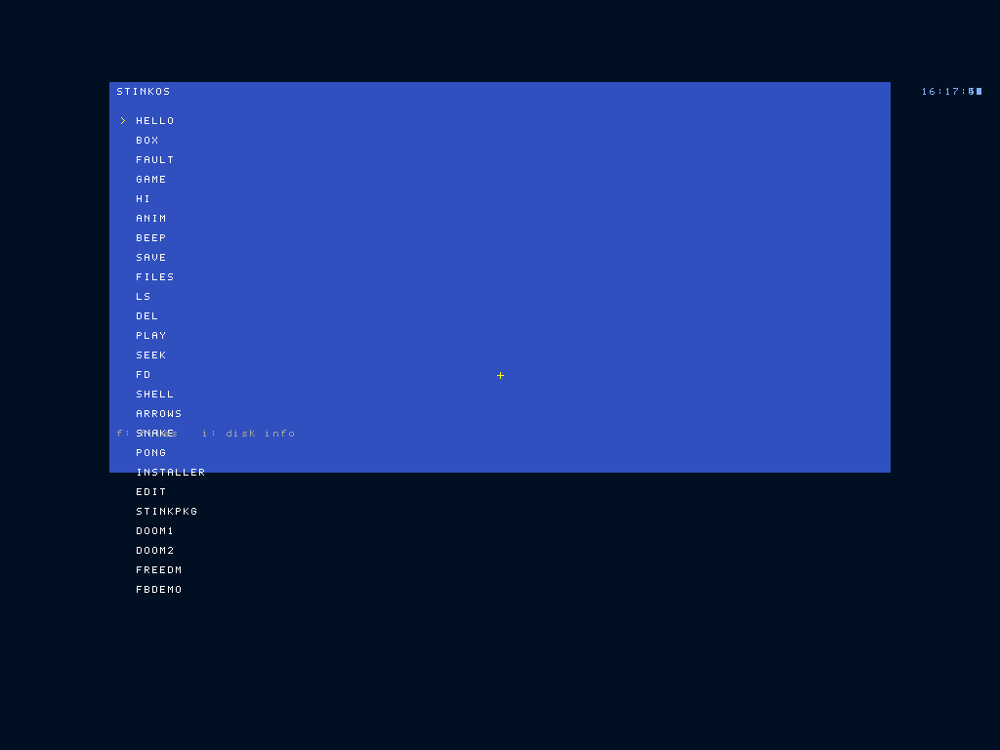
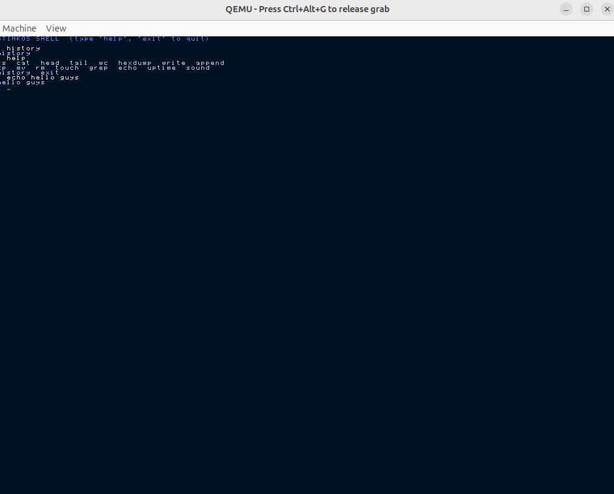
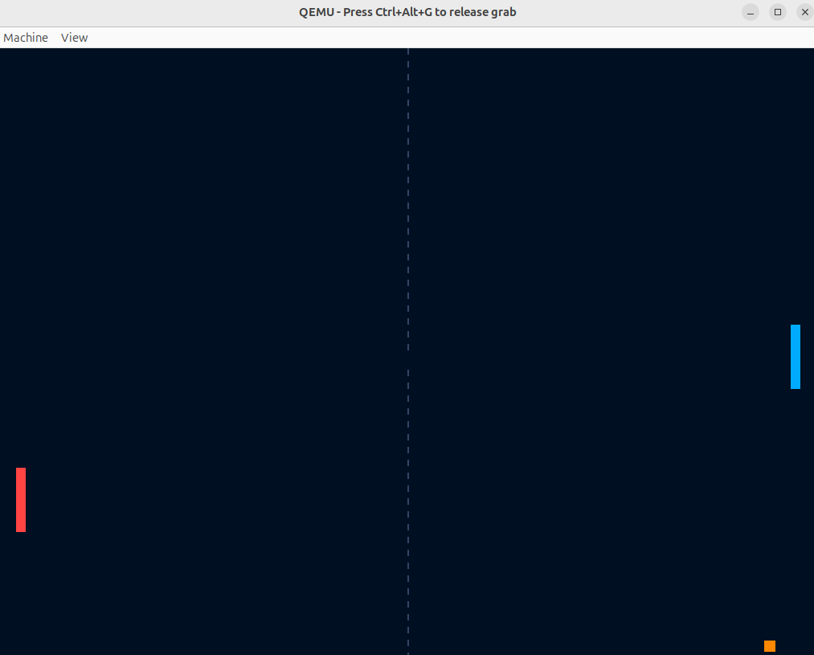
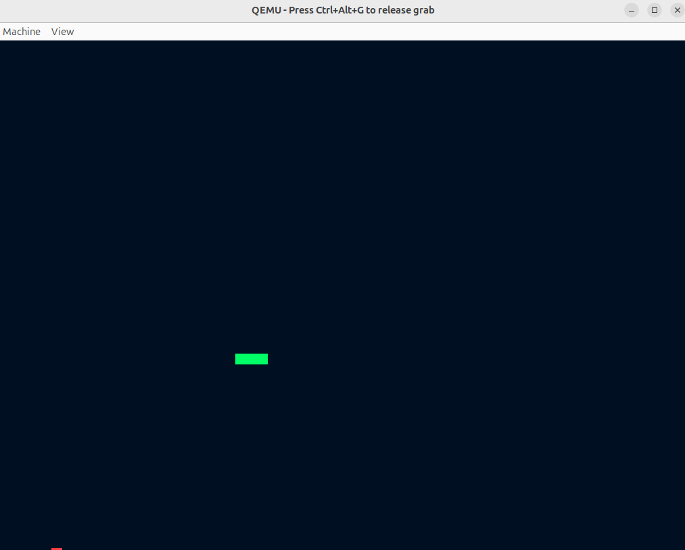

<div align="center"><pre>
███████╗████████╗██╗███╗   ██╗██╗  ██╗ ██████╗ ███████╗
██╔════╝╚══██╔══╝██║████╗  ██║██║ ██╔╝██╔═══██╗██╔════╝
███████╗   ██║   ██║██╔██╗ ██║█████╔╝ ██║   ██║███████╗
╚════██║   ██║   ██║██║╚██╗██║██╔═██╗ ██║   ██║╚════██║
███████║   ██║   ██║██║ ╚████║██║  ██╗╚██████╔╝███████║
╚══════╝   ╚═╝   ╚═╝╚═╝  ╚═══╝╚═╝  ╚═╝ ╚═════╝ ╚══════╝
       An x86 PC operating system. Written from scratch.
                  Boots real hardware. No libc. No regrets.
</pre></div>

<p align="center"><strong>boot sector → kernel → paging → ring 3 → syscalls → filesystem · zero external dependencies · C + assembly</strong></p>

<p align="center">
  <a href="LICENSE"></a>
  
  
  
  
</p>

<p align="center">
  <a href="#what-this-actually-is">What it is</a> ·
  <a href="#what-it-does-today">What it does</a> ·
  <a href="#run-it-2-minutes">Run it</a> ·
  <a href="#syscalls">Syscalls</a> ·
  <a href="#write-an-app">Write an app</a> ·
  <a href="#roadmap">Roadmap</a> ·
  <a href="CONTRIBUTING.md">Contribute</a>
</p>

---

## What this actually is

A real, 32-bit x86 operating system. Not a Linux distro with a custom theme. Not a tutorial that stops at "Hello, kernel!"

StinkOS boots a PC (or QEMU). It enters protected mode, sets up paging, launches user programs in Ring 3 with their own isolated address spaces, and lets them call back into the kernel through a syscall ABI. Same shape as a real OS — just smaller in every direction.

Everything in this repo was written from a blank disk image. The bootloader. The kernel. The drivers. The filesystem. The userland C library. The apps. No libc. No prebuilt kernel. No imported bootloader. Just `boot.s`, a kernel in C, a handful of drivers, and a flat-file filesystem I cobbled together.

Yeah, the name is a joke. The code isn't.

## Screenshots

<p align="center">
  
  
</p>
<p align="center">
  
  
</p>

## What it does today

On boot, StinkOS will:

1. **Load itself from disk** via the BIOS, enable A20, build a GDT, and switch the CPU into 32-bit protected mode. (`boot.s`)
2. **Set a VBE linear framebuffer** at 1024×768×32 — pixels go straight to video memory. (`vbe.c`, `fb.c`)
3. **Wire up interrupts** — IDT, remap the PIC, configure the PIT at 100 Hz, drive the PS/2 keyboard. (`trap.c`, `keyboard.c`)
4. **Enable paging** with a 4 MiB identity map for the kernel, backed by a physical frame allocator. Userland gets its own isolated 4 KiB-paged region. (`paging.c`, `pmm.c`)
5. **Install a TSS** and drop into a graphical start menu. (`menu.c`, `gdt.c`)
6. **Load and run apps in Ring 3.** The kernel reads a named ELF file from StinkFS, copies it into a fresh user address space, and `iret`s into user code. The app talks to the kernel only through `int 0x80`. When it exits or faults, control returns to the menu — a misbehaving app cannot take down the system. (`elf.c`, `usermode_asm.s`)

There's also a filesystem of my own design (`fs.c` — "StinkFS"), a PC speaker driver (`speaker.c`), an ATA disk driver (`ata.c`), and a serial console used for debug output (visible in the QEMU stdio log). The boot path ends with a BIOS-style POST screen reporting each subsystem's status (`bootdiag.c`), and a network stack (e1000 NIC → ARP/IP/ICMP/UDP/TCP/DHCP/DNS) backs the shell's `netinfo` and `ping` commands.

## Run it (2 minutes)

You need an `i386-elf` cross-compiler and `qemu-system-i386`.

```bash
# one-time: build the cross-toolchain (~30-60 min)
bash tools/build-cross-toolchain.sh
source ~/.bashrc

# build and boot in QEMU
make run
```

Want to verify it boots without staring at it?

```bash
make test-headless     # boots in qemu, asserts via serial log
```

Other useful targets: `make` (build only), `make hex` (hexdump the disk image), `make dall` (disassemble), `make clean`.

## Syscalls

Userland talks to the kernel via `int 0x80`. `eax` = syscall number, args in `ebx`/`ecx`/`edx`, return value in `eax`.

| # | Name | Arguments | Effect |
|--:|------|-----------|--------|
| 1 | `log`     | `ebx`=str                        | Write a line to the debug serial console |
| 2 | `draw`    | `ebx`=x `ecx`=y `edx`=rgb         | Plot a pixel |
| 3 | `getkey`  | —                                 | Return next keypress (0 if none) |
| 4 | `alloc`   | —                                 | Hand back a fresh page of user memory |
| 5 | `exit`    | —                                 | Return to the menu |
| 6 | `ticks`   | —                                 | Timer ticks since boot (10 ms each) |
| 7 | `sound`   | `ebx`=hz                          | Beep at frequency (0 = silence) |
| 8 | `fwrite`  | `ebx`=name `ecx`=buf `edx`=size   | Write a file in StinkFS |
| 9 | `fread`   | `ebx`=name `ecx`=buf `edx`=max    | Read a file from StinkFS |
| 10 | `fcount` | —                                 | Number of files in StinkFS |
| 11 | `finfo`  | `ebx`=idx `ecx`=name_buf          | Name of the i-th file |
| 12 | `fdelete`| `ebx`=name                        | Delete a file |
| 13 | `fappend`| `ebx`=name `ecx`=buf `edx`=size   | Append to an existing file |

The table above is a representative slice; the ABI is ~44 calls today — file
and VFS I/O, on-screen text and blits, audio, TCP/UDP sockets, DNS, `netinfo`
and `ping`, `exec`, and direct framebuffer mapping. C apps don't write
`int 0x80` by hand — `lib/libstink.h` wraps each call as a static inline. Drop
it in and call `sys_draw(x, y, 0xff00ff)`.

## Userland apps

Apps are independent ELF binaries. They live as named ELF files in StinkFS and show up in the start menu at boot:

| Name | What it is |
|------|------------|
| `HELLO` / `BOX`       | Assembly demos — log to serial, paint pixels |
| `FAULT`               | Deliberately touches kernel memory, gets killed cleanly |
| `GAME`                | Keyboard-controlled block (assembly) |
| `HIC` / `ANIM`        | First C apps — prove `crt0.s` + `libstink.h` work |
| `BEEP`                | Plays notes through the PC speaker |
| `SAVE` / `FILES` / `LS` / `DEL` | StinkFS demos: write, list, read, delete |
| `PLAY`                | A tiny collector game that persists its high score in StinkFS |

## Write an app

```c
#include "libstink.h"

void main(void) {
    sys_log("hello from ring 3");

    for (int y = 100; y < 300; y++)
        for (int x = 100; x < 500; x++)
            sys_draw(x, y, 0x00ffaa);

    while (sys_getkey() != 27) { /* wait for ESC */ }
    sys_exit();
}
```

Add a build rule beside the others in the `Makefile`, list the resulting `.elf`
in the `make-stinkfs.py` arguments at the end of the `os` target so it gets
written into StinkFS as a named file, and `make run`. The menu picks it up
automatically.

## Components

The kernel sources are grouped by subsystem under `kernel/`, with the boot
assembly and link script in `boot/`. Object files build flat into `build/`;
the Makefile resolves a bare source or `#include "foo.h"` to the right
subdirectory via `VPATH` and `-I` include paths. Broad consumers (the boot
path, the syscall dispatch) include `kernel/defs.h`, an umbrella that pulls in
every subsystem header so they need a single include instead of a long list.

| Area | Files |
|------|-------|
| Boot, protected-mode entry           | `boot/boot.s`, `boot/linker.ld` |
| Kernel entry                         | `kernel/main.c` (`kmain`) |
| Interrupts (IDT, PIC, PIT)           | `kernel/sys/trap.c`, `boot/interrupts_asm.s` |
| Syscall dispatch (`int 0x80`)        | `kernel/sys/syscall.c` |
| GDT + TSS                            | `kernel/arch/gdt.c`, `boot/gdt_asm.s` |
| Paging, physical memory              | `kernel/arch/paging.c`, `kernel/arch/pmm.c` |
| Video (VBE + framebuffer + font)     | `kernel/drivers/video/{vbe,fb,font}.c` |
| Input (keyboard, mouse)              | `kernel/drivers/input/{keyboard,mouse}.c` |
| Storage (ATA), audio, misc           | `kernel/drivers/storage/ata.c`, `kernel/drivers/audio/`, `kernel/drivers/misc/{serial,rtc}.c` |
| Network stack                        | `kernel/drivers/net/` (e1000, ethernet, arp, ipv4, icmp, udp, tcp, dhcp, dns, pci) |
| StinkFS + VFS                        | `kernel/fs/{fs,vfs,mbr}.c` |
| ELF loader + Ring 3 entry            | `kernel/sys/elf.c`, `kernel/ui/menu.c`, `boot/usermode_asm.s` |
| Userland C library                   | `lib/libstink.h`, `apps/crt0.s` |

## Docs

Deep dives live under `docs/`:

| File | Covers |
|---|---|
| [`docs/ARCHITECTURE.md`](docs/ARCHITECTURE.md) | Kernel layout, paging, process model, app lifecycle |
| [`docs/SYSCALLS.md`](docs/SYSCALLS.md) | Full `int 0x80` number table, args, returns |
| [`docs/NETWORK.md`](docs/NETWORK.md) | TCP/IP layering, DHCP boot timing, TCP state graph |
| [`docs/STINKFS.md`](docs/STINKFS.md) | On-disk filesystem format |
| [`docs/PACKAGING.md`](docs/PACKAGING.md) | How to author a `.stinkpkg` |
| [`docs/MEMORY.md`](docs/MEMORY.md) | Memory accounting + leak-sweep methodology |
| [`docs/TUTORIAL.md`](docs/TUTORIAL.md) | Build from scratch in 10 steps |

## Toolchain — why a cross-compiler?

The host `gcc` assumes it's producing programs for the host OS. Forcing it to emit bare-metal code works for tiny examples and becomes a source of subtle bugs as the OS grows. The `i386-elf` cross-compiler carries none of those assumptions — it produces ELF binaries for a freestanding i386 target, period. It's the boring, correct foundation.

`tools/build-cross-toolchain.sh` builds binutils + gcc for the `i386-elf` target into `~/opt/cross`. Once, then forget it exists.

## Roadmap

**Done:**

- [x] 32-bit protected mode (LBA load, A20, GDT, TSS)
- [x] VBE linear framebuffer, font + text rendering
- [x] Interrupts: IDT, PIC remap, PIT timer, PS/2 keyboard
- [x] Paging + physical frame allocator
- [x] Userland (Ring 3), isolated address space, fault isolation
- [x] ELF program loader
- [x] StinkFS (flat named files, persisted to disk; apps load from here)
- [x] Sound — PC speaker + Sound Blaster 16 (DMA-driven output)
- [x] Start menu, graphical shell, full-screen text editor
- [x] PS/2 mouse driver + cursor, exposed to apps via syscall
- [x] Networking — e1000 NIC, ARP/IP/ICMP/UDP/TCP, DHCP/DNS, `netinfo`/`ping`
- [x] `sys_map_fb` — apps blit by writing the framebuffer directly
- [x] Package manager (`stink-pkg`) with SHA-256 integrity verification
- [x] Boot-time POST diagnostic with per-subsystem status

**Up next** (in no particular order):

- [ ] Preemptive multitasking — multiple concurrent Ring 3 processes
- [ ] Doom music (needs an OPL/MIDI synth; sound effects already play via the SB16 mixer)

## Doom

Yeah, Doom. Phase 1, Phase 2 and FreeDM all run.

**One-time setup — get the WADs:**

```bash
bash tools/fetch-wads.sh        # downloads freedoom-0.13.0 + freedm into wads/
```

That pulls ~33 MB from the official [Freedoom GitHub release](https://github.com/freedoom/freedoom/releases). The `wads/` directory is gitignored — those binaries aren't part of the source.

If you have a commercial `doom.wad` or `doom2.wad` you'd rather use, drop it under `wads/` and the build will pick it up by overriding the file path:

```bash
make FREEDOOM1_WAD=path/to/doom.wad
```

**Build and run:**

```bash
make run
```

The boot menu picks up three new entries — `DOOM1`, `DOOM2`, `FREEDM`. Pick one with arrows, Enter, and the engine fires up against the matching IWAD. The disk image grows to ~100 MiB because the WADs live in StinkFS alongside the kernel.

**Controls (vanilla Doom set):**

| Key | Action |
|---|---|
| `W` / arrows up | walk forward |
| `S` / arrows down | walk back |
| `A` / `D` | strafe |
| ← / → | turn |
| Left Ctrl | fire |
| Space | open door / use |
| Shift | run |
| `1`–`9` | select weapon |
| Tab | automap |
| Esc | menu |

**What works:** all 36 Doom 1 maps, all 32 Doom 2 maps, all monsters, weapons, power-ups, save/load (via StinkFS), automap, intermissions, cheats (`IDDQD`, `IDKFA`, etc.), and sound effects through the Sound Blaster 16 mixer.

**What doesn't (yet):** music (needs an OPL/MIDI synth backend StinkOS doesn't have yet), and network multiplayer (the stack exists; the engine's netgame layer isn't wired).

**How the port works under the hood:** vendored doomgeneric (Chocolate Doom derivative) lives in `apps/doom/`; `apps/doom-shims/` provides the POSIX headers Doom expects, and `lib/libstink_{alloc,stdio,printf,posix,setjmp}` are the corresponding runtime backends. The platform layer is `apps/doom/doomgeneric_stink.c` (~200 lines). One source tree, three ELFs — each compiled with a different `-DSTINKDOOM_IWAD` so the `DOOM1` / `DOOM2` / `FREEDM` menu entries auto-load the right WAD.

**License notice (Doom):** the Doom engine source under `apps/doom/` is © id Software, released under the GNU General Public License v2.0 — see [`COPYING.GPL`](COPYING.GPL) (also at `apps/doom/LICENSE`). The doomgeneric port is © Jakub Świątek, same licence. Any binary StinkOS image you ship that bundles Doom carries that GPLv2 obligation: source must be made available to recipients. The IWADs themselves (Freedoom 1, Freedoom 2, FreeDM) are under their own permissive [BSD-3-Clause](https://github.com/freedoom/freedoom/blob/master/COPYING.adoc); the original commercial `DOOM.WAD` / `DOOM2.WAD` files are not redistributable -- buy them or use the Freedoom replacements `tools/fetch-wads.sh` downloads.

## Contributing

PRs welcome. Start with [CONTRIBUTING.md](CONTRIBUTING.md) — it's short. For anything bigger than a bug fix, open an issue first so we can agree on shape before you spend a weekend on it.

By participating you agree to the [Code of Conduct](CODE_OF_CONDUCT.md). Found a security issue? See [SECURITY.md](SECURITY.md).

## Acknowledgments

StinkOS exists because [@suwateru](https://github.com/suwateru) got me into low-level back in mid-2024 — my first C, my first segfaults, my first time the stack pointer actually made sense. The project is based on her original [StinkOS](https://github.com/suwateru/StinkOS); what's here now is two years of self-study built on what she started.

## License

[GPLv3](LICENSE). Use it, fork it, learn from it, run it on weird hardware, write a thesis about it — but if you distribute something derived from this code, the source has to stay open. That's the deal.

## Why "Stink"?

Honestly? Because the first version was held together with duct tape and prayers, and the name kind of stuck. By the time it was good enough to not stink, the joke was funnier than any "serious" name I could come up with. Embrace the bit.
